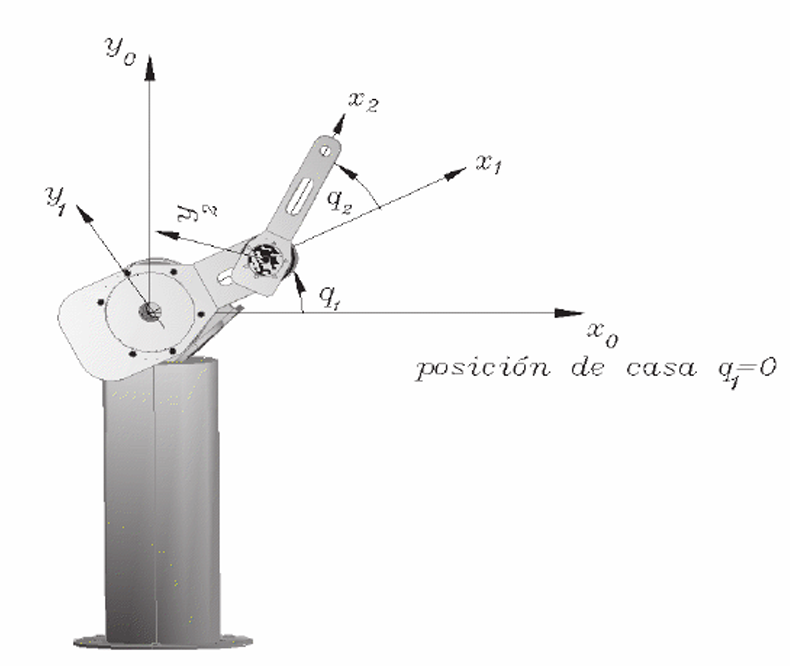
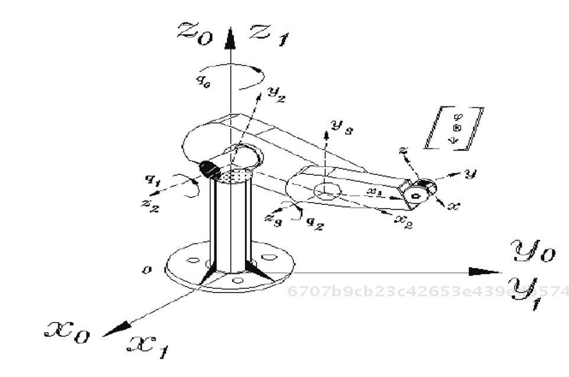
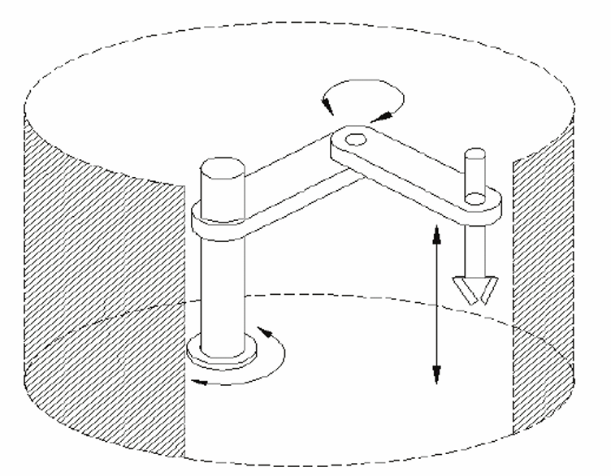
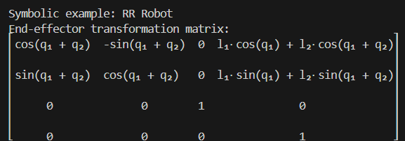
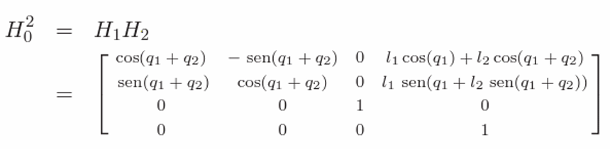
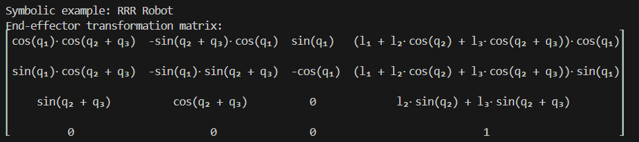
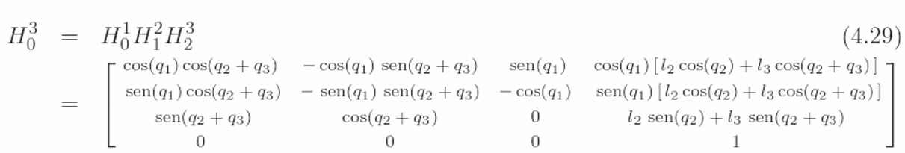
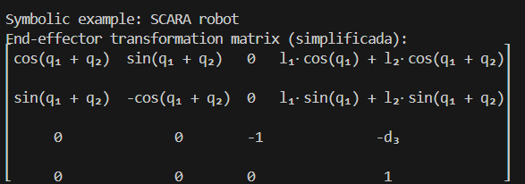
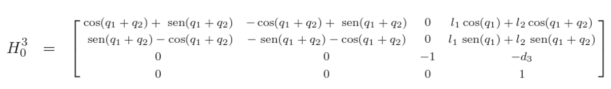

 
# Reporte: Implementación de Cinemática Directa en Robots Manipuladores

## Introducción
La cinemática directa constituye uno de los pilares fundamentales en el análisis y control de sistemas robóticos, ya que permite determinar la posición y orientación del efector final a partir de los parámetros articulares del manipulador. Su correcta formulación es esencial tanto para el diseño como para la simulación y control de robots industriales y de investigación.

En el presente trabajo se implementó la cinemática directa utilizando el lenguaje de programación **Python**, aplicando la **convención de Denavit-Hartenberg (DH)** para la formulación de matrices de transformación homogénea. El enfoque principal se centró en la generación simbólica de dichas matrices, permitiendo una representación algebraica precisa y generalizable para distintos tipos de robots.

Se analizaron tres configuraciones robóticas:

- **RR**: manipulador planar con dos articulaciones rotacionales.  
- **RRR**: manipulador con tres articulaciones rotacionales.  
- **SCARA**: robot industrial con dos articulaciones rotacionales y una prismática.  

Aunque el desarrollo simbólico fue el objetivo principal del proyecto, se incorporó adicionalmente una versión numérica como recurso complementario para validar los resultados obtenidos y explorar el comportamiento computacional de los modelos.

---

## Metodología

### Implementación de la cinemática directa
La cinemática directa se desarrolló en Python utilizando la convención de Denavit-Hartenberg (DH) para modelar la geometría de los manipuladores robóticos. Se emplearon las librerías **Sympy** y **NumPy**, que permitieron construir matrices de transformación homogénea de forma simbólica, representando los parámetros articulares y geométricos como variables algebraicas.

### Adaptaciones realizadas en el código
El código base proporcionado (`example2.py`) fue modificado y extendido para adaptarse a tres configuraciones robóticas distintas: **RR, RRR y SCARA**.  

- Para cada robot se creó un archivo independiente: `Robot RR.py`, `Robot RRR.py`, `Robot SCARA.py`.  
- Se implementaron funciones de limpieza numérica para mejorar la legibilidad de las matrices finales, eliminando residuos numéricos cercanos a cero.  

### Parámetros definidos por robot
#### Robot RR
Se definieron dos articulaciones rotacionales (q₁, q₂) y dos longitudes de eslabón (l₁, l₂).
Se asignaron valores de torsión αᵢ = 0, ya que el movimiento se desarrolla en el plano.

---

#### Robot RRR
Se agregó una tercera articulación rotacional (q₃) y una longitud adicional (l₃).
Se extendió la lógica de multiplicación de matrices para incluir el tercer eslabón.

---

#### Robot SCARA
Se incorporó una articulación prismática representada por el desplazamiento d₃.
Se asignó una torsión de α₂ = π en el segundo eslabón, conforme a la tabla DH del modelo SCARA.

### Objetivo de la implementación
El objetivo principal fue construir matrices de transformación homogénea simbólicas que describieran con precisión la posición y orientación del efector final de cada robot a partir de sus parámetros articulares. Asimismo, se buscó validar los modelos teóricos mediante la comparación con resultados de referencia en literatura especializada.

---

## Resultados

### Robot RR
**Resultado obtenido en el programa:**

**Referencia del libro:**

La matriz obtenida en el programa coincidió exactamente con la referencia bibliográfica. Tanto la parte rotacional como la columna de traslación resultaron equivalentes, confirmando la correcta implementación de la cinemática directa para un manipulador planar de dos grados de libertad.

### Robot RRR
**Resultado obtenido en el programa:**

**Referencia del libro:**

La matriz generada en el programa presentó la misma estructura que la referencia, tanto en la parte rotacional como en la traslación. El único detalle adicional fue la inclusión explícita de la longitud `l1` en la proyección sobre el eje `x,y`, lo cual corresponde al primer eslabón fijo en la dirección de `q1`. Esta diferencia responde a la convención empleada en la parametrización, pero no afecta la validez de la formulación.

### Robot SCARA
**Resultado obtenido en el programa:**

**Referencia del libro:**

En este caso, la matriz obtenida en la programación conserva la estructura ortonormal propia de un robot SCARA: una rotación en el plano `x,y` dada por `Rz(q1+q2)`, la inversión del eje `z` con el valor `-1`, y la traslación compuesta por las longitudes `l1` y `l2` en el plano horizontal y el desplazamiento prismático `-d3` en el eje vertical.  
En la referencia aparecen términos combinados de tipo `(cos + sen)`, pero el análisis confirma que la matriz obtenida en el programa refleja con mayor fidelidad la formulación canónica de la cinemática directa del SCARA.

---

## Conclusiones
La implementación realizada en Python, basada en la convención de Denavit-Hartenberg, permitió generar de manera simbólica y numérica las matrices de transformación homogénea de tres configuraciones robóticas (RR, RRR y SCARA).

Los resultados muestran coincidencia con las referencias teóricas, validando la correctitud del modelo desarrollado en el programa. Se concluye que el código es funcional, modular y adaptable, representando una herramienta útil para el análisis y enseñanza de la cinemática directa.
